# 国债期货 CSCV 回测过拟合检验框架 | CSCV Backtest Overfitting Detection for CGB Futures

<p align="center">
  <a href="#zh"></a>
  <a href="#en"></a>
</p>

<a id="zh"></a>

## 中文

### 1. 项目简介

本仓库是面向国债期货 T / TL 多参数策略的稳健性验证框架，核心仍是标准 CSCV/PBO，同时新增通用的 Dynamic Parameter Selection Audit。仓库输入是通用策略收益矩阵，不绑定任何特定策略族。

### 2. CSCV / PBO 方法原理

CSCV/PBO 是标准组合对称交叉验证框架。它把完整样本切成连续 blocks，枚举对称的 IS/OOS 组合，在 IS 中选择最优策略，然后观察该策略在 OOS 中的排名。若 OOS percentile 低于 0.5，则记为过拟合事件，PBO 为这些事件占比。

### 3. Dynamic Parameter Selection Audit

Dynamic Parameter Selection Audit 是通用 walk-forward 参数选择稳健性诊断。它在训练窗口中根据 `selection_metric` 选择策略，在下一段 OOS 窗口中检验真实表现，并统计 `selected_oos_rank`、`selected_oos_percentile`、`dynamic_selection_failure_rate`、`selection_score_vs_oos_performance` 和 `parameter_stability`。

### 4. CSCV 与 Dynamic Audit 的区别

- CSCV/PBO 检测静态参数搜索在对称样本切分下的过拟合风险。
- Dynamic Audit 检测滚动训练窗口中的动态选参是否稳定。
- `dynamic_selection_failure_rate` 不是标准 PBO。
- Dynamic Audit 不替代 CSCV，而是补充诊断动态选参过程是否把过拟合从静态 grid search 转移到滚动窗口。

### 5. 数据与策略收益矩阵

输入数据标准化为 `datetime/open/high/low/close/volume/open_interest`。策略收益矩阵的行是 5 分钟 bar，列是 `strategy_id / parameter_id`。信号在 bar `t` 形成，收益用 `position.shift(1)` 落在 bar `t+1`，避免 future leakage。默认年化频率为 `252 * 54`。

### 6. T / TL 检验结果

#### CSCV / PBO

| contract | sample_start | sample_end | n_strategies | n_combinations | PBO | median_oos_rank | mean_is_performance | mean_oos_performance | degradation_ratio |
| --- | --- | --- | --- | --- | --- | --- | --- | --- | --- |
| T | 2024-01-02 09:35:00 | 2026-04-24 15:15:00 | 9123 | 70 | 0.6429 | 0.3971 | 2.7149 | -0.3999 | -0.1473 |
| TL | 2024-01-02 09:35:00 | 2026-04-25 11:30:00 | 9123 | 70 | 0.5000 | 0.5106 | 2.7003 | 0.0920 | 0.0341 |

#### Dynamic Parameter Selection Audit

| contract | n_windows | selection_metric | dynamic_selection_failure_rate | mean_selected_oos_percentile | score_oos_corr | score_oos_rank_corr | parameter_switch_count | parameter_entropy |
| --- | --- | --- | --- | --- | --- | --- | --- | --- |
| T | 456 | sharpe | 0.5351 | 0.4588 | -0.0065 | -0.0029 | 157 | 4.0459 |
| TL | 457 | sharpe | 0.4748 | 0.5387 | 0.0522 | 0.0298 | 127 | 3.6166 |

### 7. 图表展示

#### T

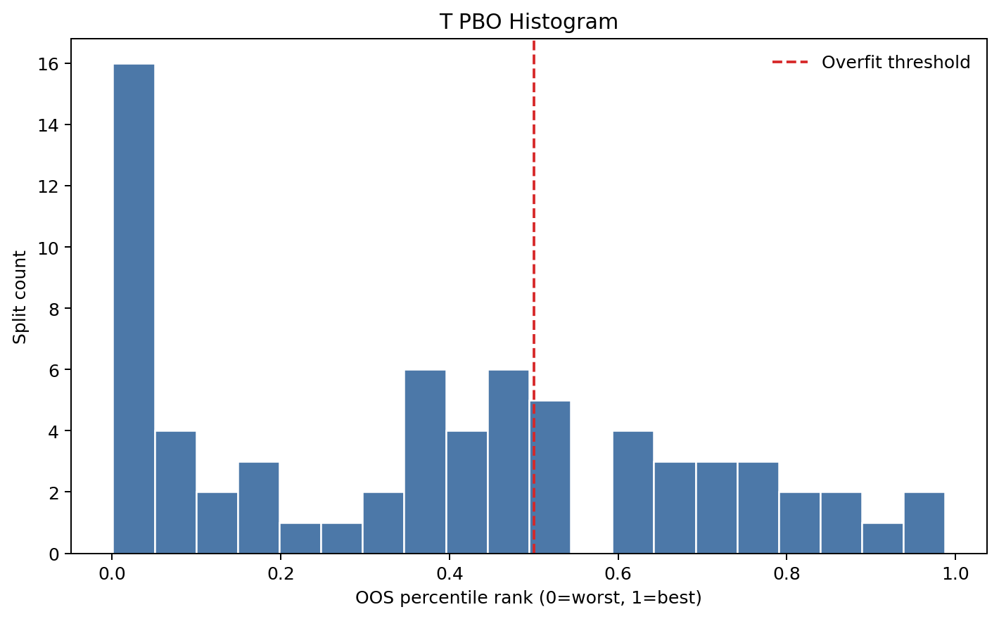

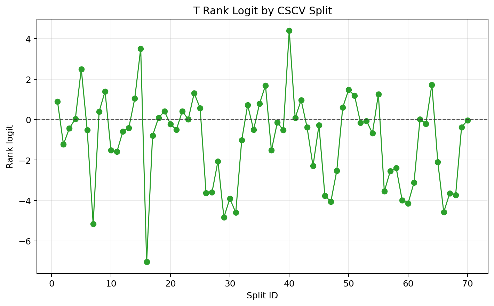

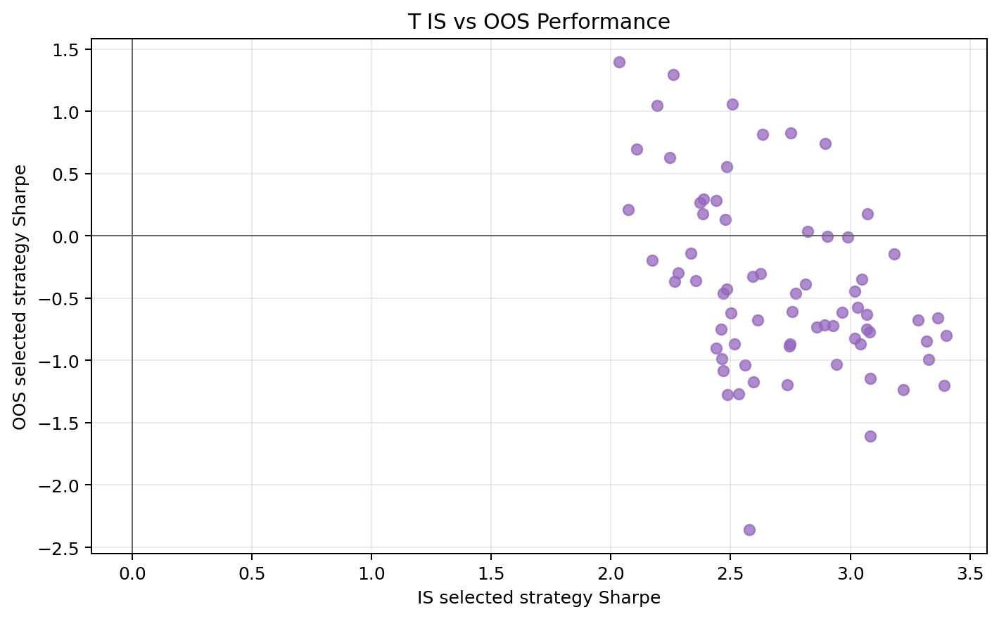

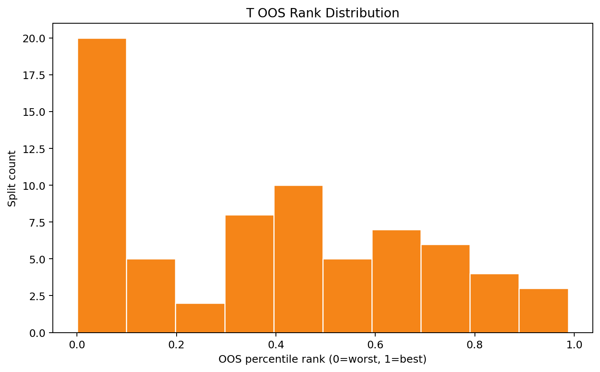

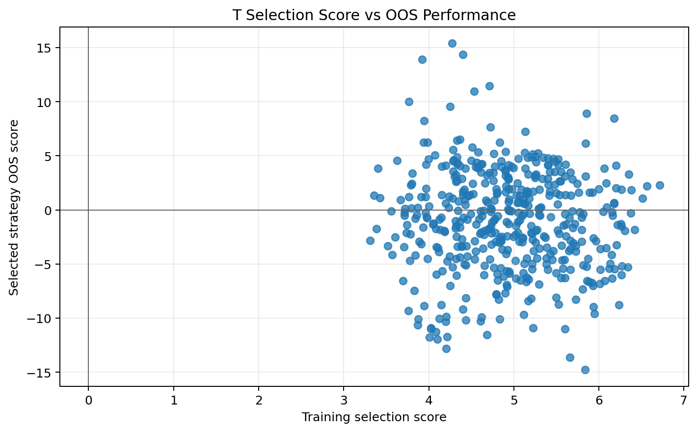

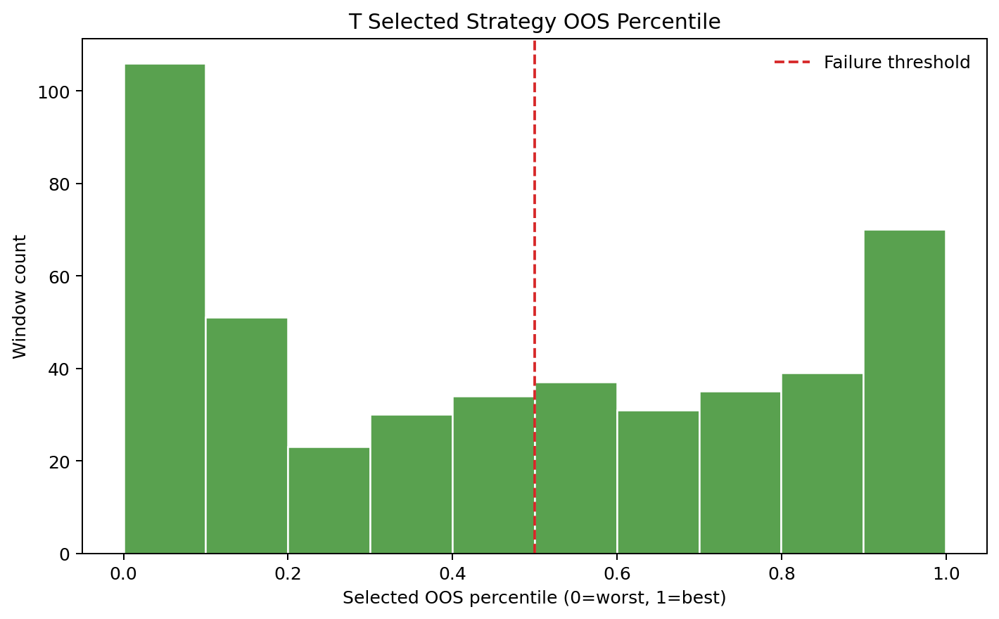

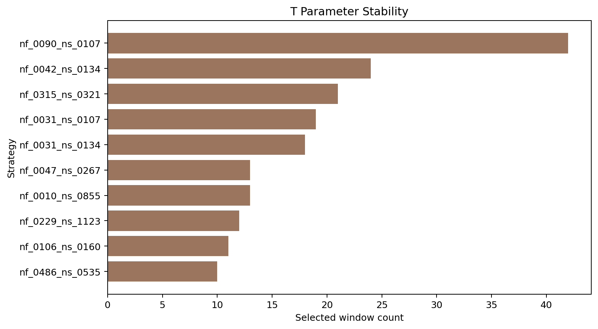

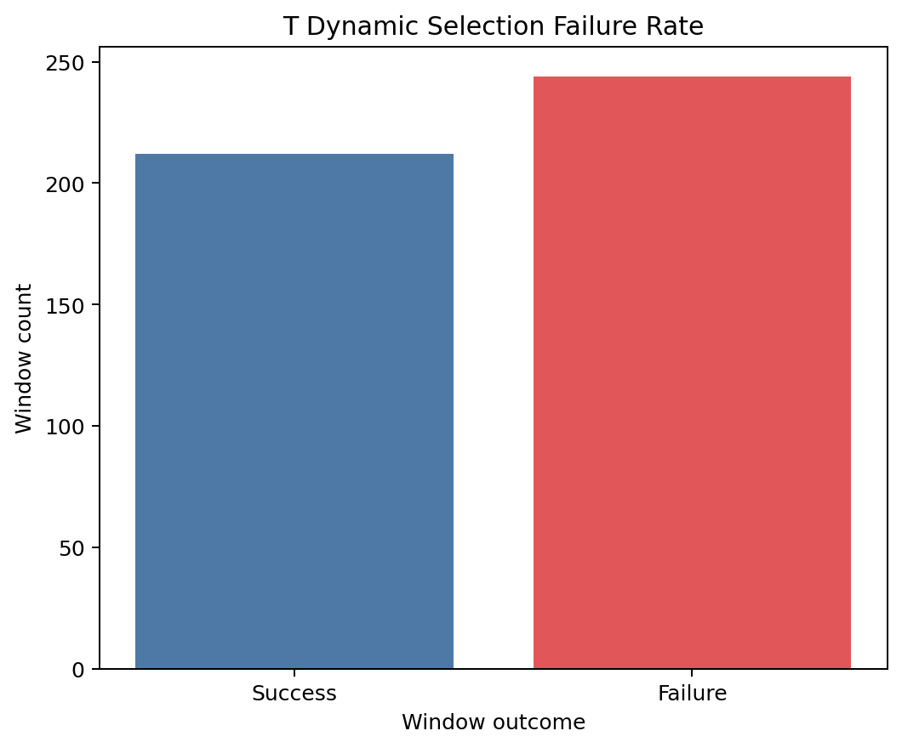

#### TL

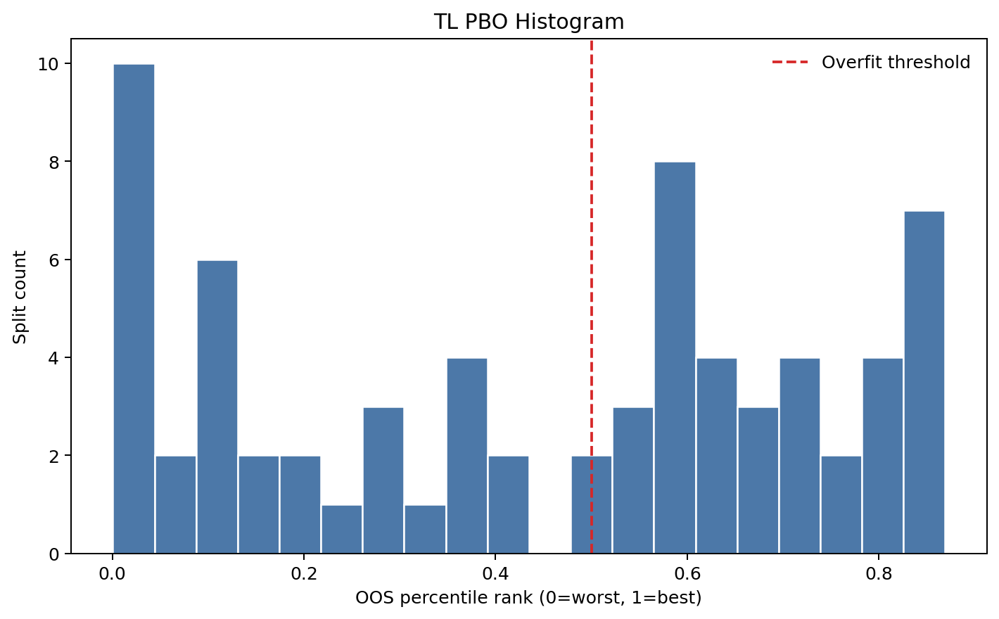

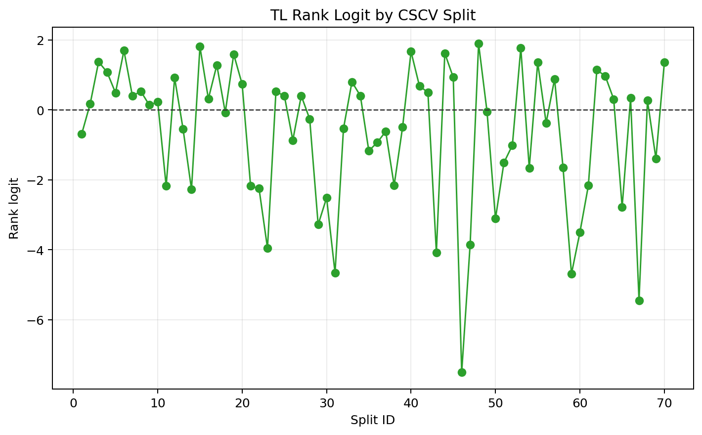

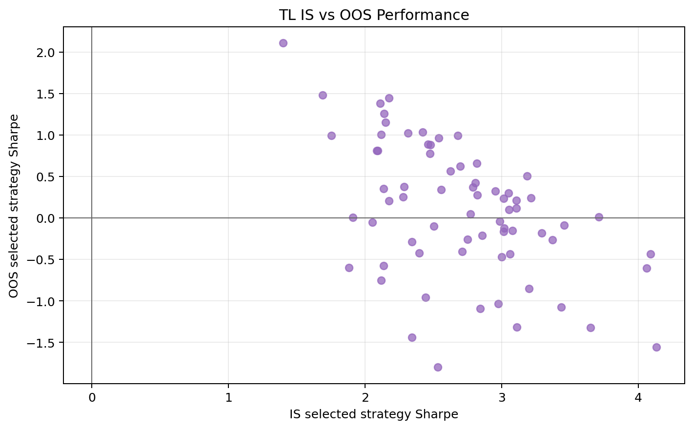

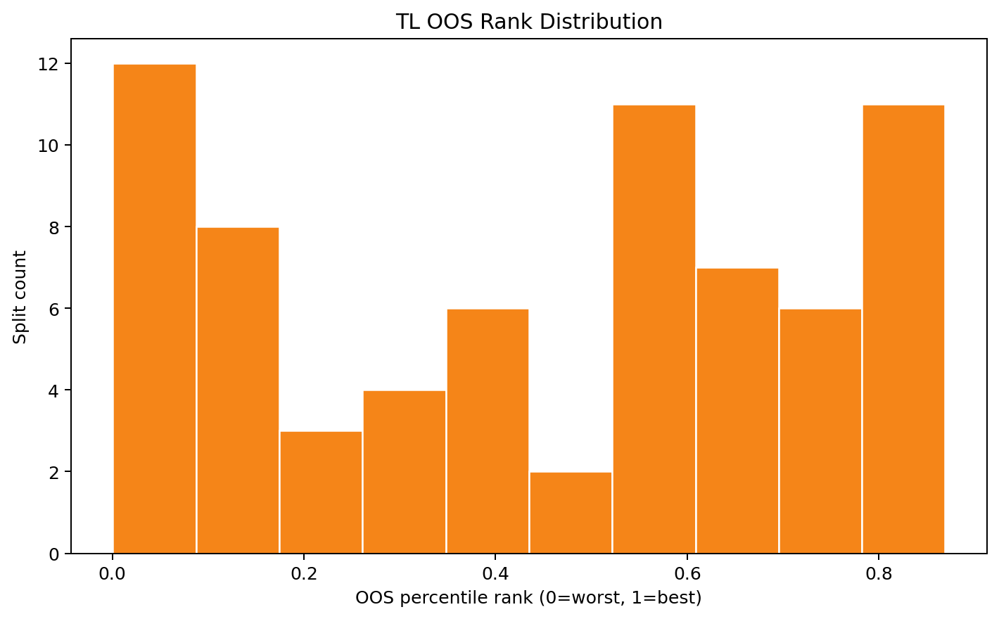

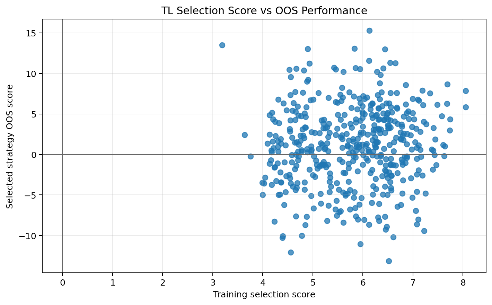

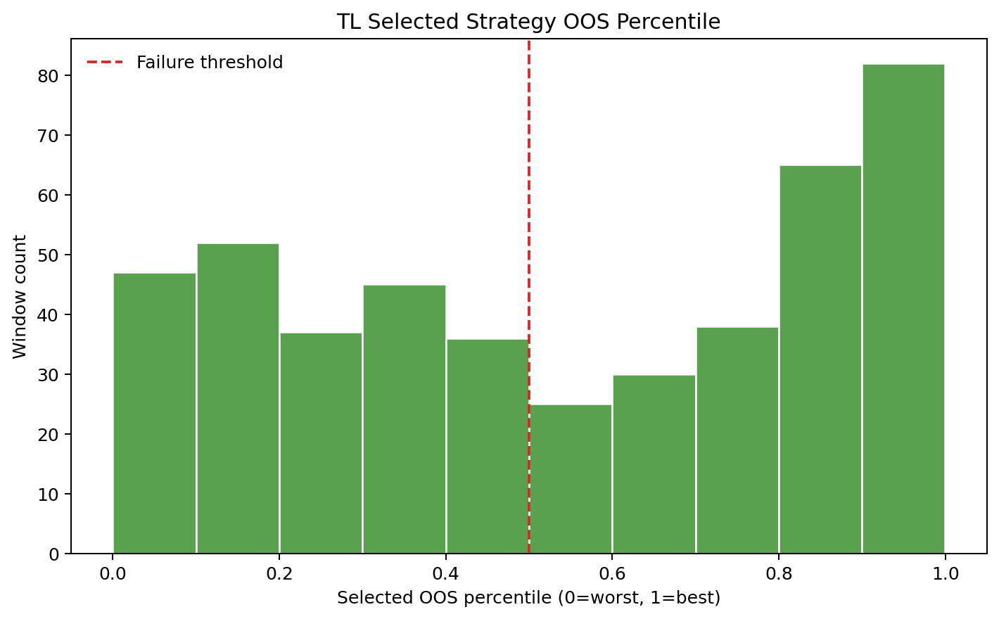

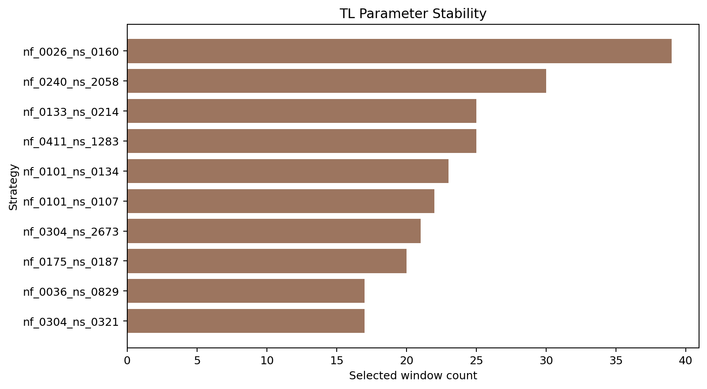

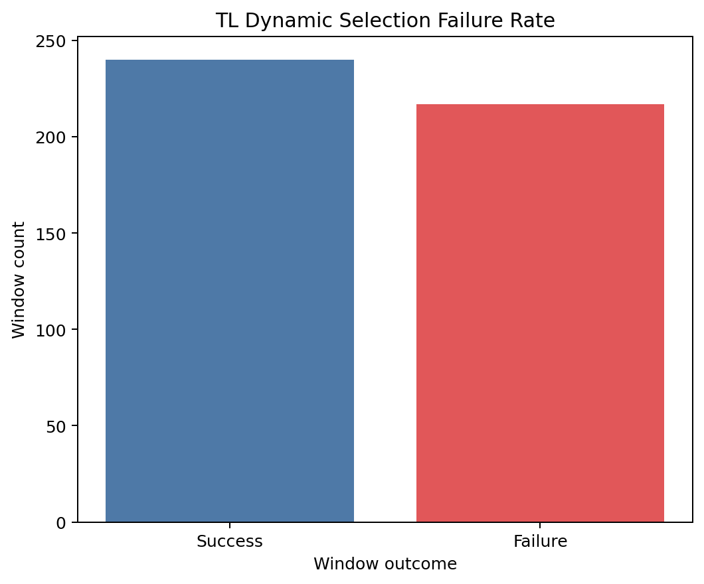

### 8. 快速开始

```bash
pip install -r requirements.txt
python -m compileall src scripts
```

若缺少数据，请将以下文件放入 `data/raw/`：

- `10年国债期货_5min_3年.xlsx`
- `30年国债期货_5min_2年.xlsx`

### 9. 运行命令

```bash
python scripts/run_cscv_pipeline.py --mode strategy_matrix --contract ALL --start-date 2024-01-01
python scripts/run_cscv_pipeline.py --mode cscv --contract ALL --n-splits 8 --start-date 2024-01-01
python scripts/run_cscv_pipeline.py --mode dynamic_audit --contract ALL --train-window-days 60 --test-window-days 10 --rebalance-days 1 --selection-metric sharpe --start-date 2024-01-01
python scripts/run_cscv_pipeline.py --mode full --contract ALL --n-splits 8 --train-window-days 60 --test-window-days 10 --rebalance-days 1 --selection-metric sharpe --start-date 2024-01-01
python cscv_t_strategy.py --mode full --contract ALL --n-splits 8
```

### 10. 输出文件

- `results/tables/strategy_returns_T.csv`
- `results/tables/strategy_returns_TL.csv`
- `results/tables/cscv_summary_all.csv`
- `results/tables/dynamic_audit_summary_all.csv`
- `results/tables/parameter_stability_T.csv`
- `results/tables/parameter_stability_TL.csv`
- `results/figures/*.png`
- `results/report.md`

### 11. 方法论来源

1. Bailey, D. H., Borwein, J. M., López de Prado, M., & Zhu, Q. J. (2014). The Probability of Backtest Overfitting. Journal of Computational Finance.
2. Bailey, D. H., & López de Prado, M. The Deflated Sharpe Ratio: Correcting for Selection Bias, Backtest Overfitting and Non-Normality.
3. López de Prado, M. (2018). Advances in Financial Machine Learning. Wiley.

The Dynamic Parameter Selection Audit in this repository borrows the walk-forward validation idea to complement CSCV/PBO. It is not standard PBO and does not replace CSCV.

### 12. 局限性与免责声明

本仓库用于研究和工程复现，不构成投资建议。结果依赖数据质量、交易成本、滑点、换月规则和参数空间。Dynamic Audit 不会把 OOS 结果反向用于训练，也不应用于策略调参闭环。

<a id="en"></a>

## English

### 1. Project Overview

This repository is a CSCV-based backtest overfitting detection and robustness validation framework for CGB futures strategies. It preserves the standard CSCV/PBO workflow and adds a generic Dynamic Parameter Selection Audit. The input is a generic strategy return matrix and the framework is not tied to any specific strategy family.

### 2. CSCV / PBO Methodology

CSCV/PBO is the standard combinatorially symmetric cross-validation framework. It partitions the return matrix into chronological blocks, enumerates balanced IS/OOS combinations, selects the in-sample winner, and measures where that winner ranks out-of-sample.

### 3. Dynamic Parameter Selection Audit

The Dynamic Parameter Selection Audit is a generic walk-forward parameter-selection diagnostic. It selects parameters inside a training window using a chosen `selection_metric`, evaluates the selected strategy in the next OOS window, and reports `selected_oos_rank`, `selected_oos_percentile`, `dynamic_selection_failure_rate`, score-vs-OOS correlations, and parameter stability.

### 4. Difference between CSCV and Dynamic Audit

- CSCV/PBO measures static parameter-search overfitting risk under symmetric splits.
- Dynamic Audit measures whether rolling parameter selection remains stable out-of-sample.
- `dynamic_selection_failure_rate` is not standard PBO.
- Dynamic Audit complements CSCV; it does not replace it.

### 5. Data and Strategy Return Matrix

The pipeline standardizes raw data into `datetime/open/high/low/close/volume/open_interest`. The strategy return matrix uses timestamps as rows and strategy or parameter IDs as columns. Signals are formed at bar `t`; returns are earned with `position.shift(1)` on bar `t+1`, which is the leakage guard. The annualization frequency is `252 * 54`.

### 6. T / TL Validation Results

#### CSCV / PBO

| contract | sample_start | sample_end | n_strategies | n_combinations | PBO | median_oos_rank | mean_is_performance | mean_oos_performance | degradation_ratio |
| --- | --- | --- | --- | --- | --- | --- | --- | --- | --- |
| T | 2024-01-02 09:35:00 | 2026-04-24 15:15:00 | 9123 | 70 | 0.6429 | 0.3971 | 2.7149 | -0.3999 | -0.1473 |
| TL | 2024-01-02 09:35:00 | 2026-04-25 11:30:00 | 9123 | 70 | 0.5000 | 0.5106 | 2.7003 | 0.0920 | 0.0341 |

#### Dynamic Parameter Selection Audit

| contract | n_windows | selection_metric | dynamic_selection_failure_rate | mean_selected_oos_percentile | score_oos_corr | score_oos_rank_corr | parameter_switch_count | parameter_entropy |
| --- | --- | --- | --- | --- | --- | --- | --- | --- |
| T | 456 | sharpe | 0.5351 | 0.4588 | -0.0065 | -0.0029 | 157 | 4.0459 |
| TL | 457 | sharpe | 0.4748 | 0.5387 | 0.0522 | 0.0298 | 127 | 3.6166 |

### 7. Figures

#### T


#### TL


### 8. Quick Start

```bash
pip install -r requirements.txt
python -m compileall src scripts
```

If data is missing, place these files under `data/raw/`:

- `10年国债期货_5min_3年.xlsx`
- `30年国债期货_5min_2年.xlsx`

### 9. Example Commands

```bash
python scripts/run_cscv_pipeline.py --mode full --contract ALL --n-splits 8 --train-window-days 60 --test-window-days 10 --rebalance-days 1 --selection-metric sharpe --start-date 2024-01-01
python cscv_t_strategy.py --mode full --contract ALL --n-splits 8
```

### 10. Output Files

- `results/tables/strategy_returns_T.csv`
- `results/tables/strategy_returns_TL.csv`
- `results/tables/cscv_summary_all.csv`
- `results/tables/dynamic_audit_summary_all.csv`
- `results/tables/parameter_stability_T.csv`
- `results/tables/parameter_stability_TL.csv`
- `results/figures/*.png`
- `results/report.md`

### 11. References

1. Bailey, D. H., Borwein, J. M., López de Prado, M., & Zhu, Q. J. (2014). The Probability of Backtest Overfitting. Journal of Computational Finance.
2. Bailey, D. H., & López de Prado, M. The Deflated Sharpe Ratio: Correcting for Selection Bias, Backtest Overfitting and Non-Normality.
3. López de Prado, M. (2018). Advances in Financial Machine Learning. Wiley.

The Dynamic Parameter Selection Audit in this repository borrows the walk-forward validation idea to complement CSCV/PBO. It is not standard PBO and does not replace CSCV.

### 12. Limitations and Disclaimer

This repository is for research and engineering reproduction only. Results depend on data quality, transaction costs, slippage, roll handling, and the searched parameter universe. Dynamic audit results are diagnostics only and are not fed back into the training window for optimization.
